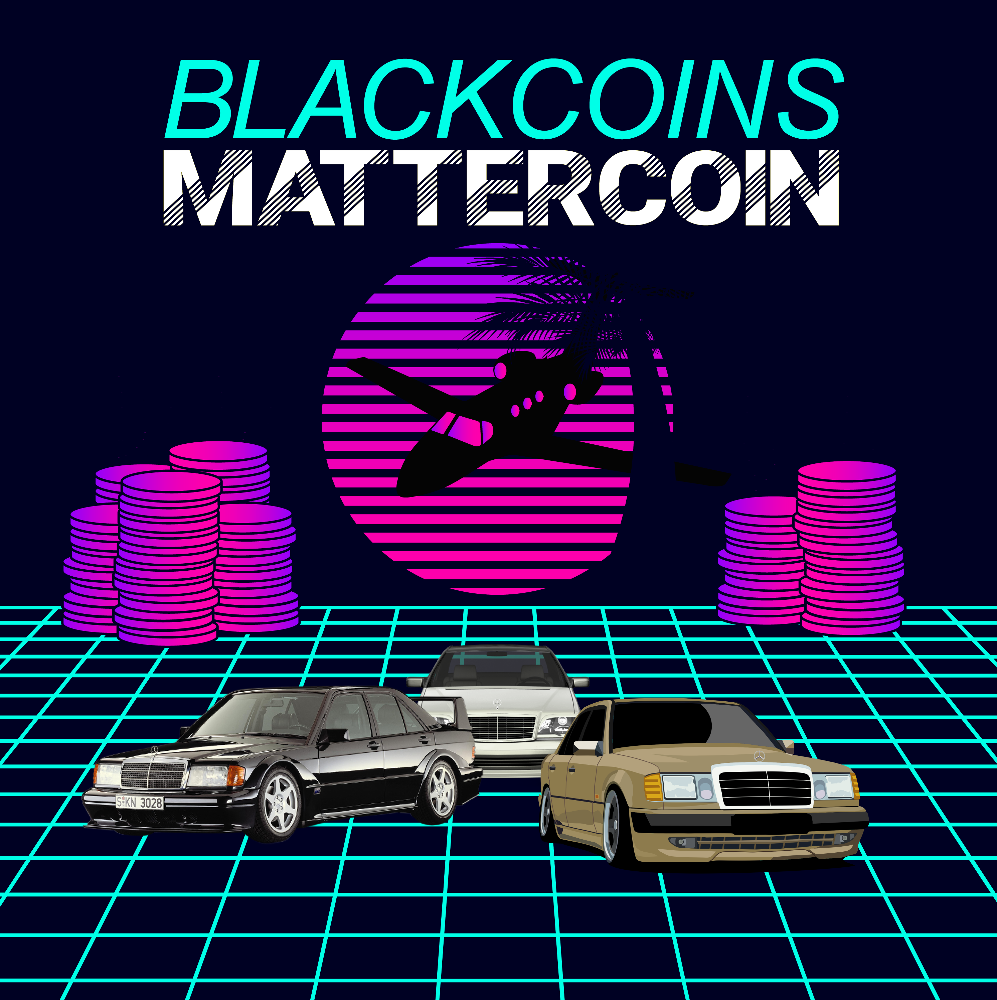
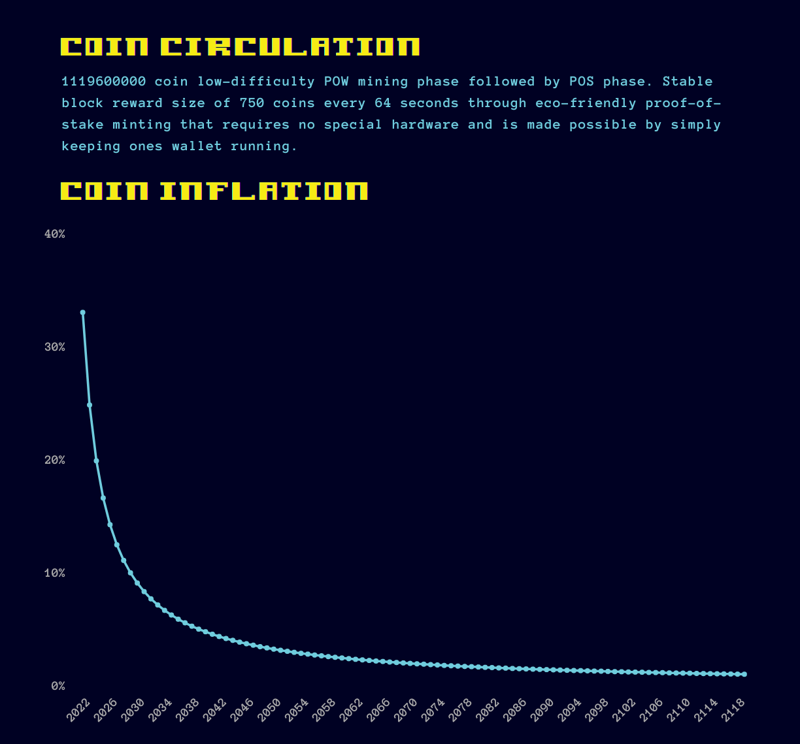

BlackCoinsMatterCoin 1.0.0

--------------

What is BlackCoinsMatterCoin?
--------------

[BlackCoinsMatterCoin](https://blackcoinsmattercoin.com/) is a cryptocurrency that implements the Proof of Stake 3.0 protocol to provide lightning fast, low-friction decentralized transactions on an enviromentally friendly blockchain infrastructure that doesn't require an arms race of complex mining hardware. It's for the people and of the people.

It aims to decarbonize and decolonize digital currency by providing the preferred sustainable framework for Black America, which has largely missed the cryptocurrency train until now due to a potential systemic lack of trust and/or interest in blockchain technologies.

  

Minty fresh
--------------

  

